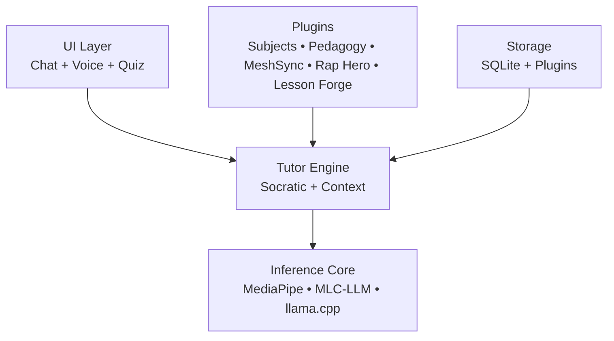

# OpenTutor Framework

[](LICENSE)

**The Linux of tutorbots** — A lightweight, modular, offline-first framework that turns discarded Android phones (2019–2023 models with 4–8 GB RAM) into private Socratic tutors.

No cloud required. Runs entirely on-device with small quantized LLMs. Designed for e-waste reuse, accessibility, and community-driven growth.

---

## Table of Contents

* [Why This Matters](#why-this-matters)
* [High-Level Architecture](#high-level-architecture)
* [Current Features](#current-features)
* [Quick Start](#quick-start)
* [Documentation](#documentation)
* [Contributing](#contributing)
* [License](#license)
* [Status](#status)

---

## Why This Matters

Old phones become personalized tutors for math, social studies, English, and science.

Teachers, students, and hobbyists can contribute plugins and share effective teaching content — all while keeping everything private and offline.

---

## High-Level Architecture



---

## Current Features

* **Plugin system** with a working basic-math example
* **MeshSync**: Offline Bluetooth sharing of small tutoring content

  * Hints
  * Question chains
  * Rap lyrics
* **Rap Hero**: Generate, lock in, and perform educational raps
* **Lesson Forge**: Guided mode for students to create short lessons with peer feedback
* **Behavioral learner state tracking** for adaptive responses
* **Media guidelines** for videos and large content (manual import only)

See `docs/media-guidelines.md` for details on MeshSync sharing.

---

## Quick Start

### Testers / Teachers

1. Clone the repository
2. Connect your Android phone (2019–2023 model recommended)
3. Run:

```bash
./gradlew assembleDebug
```

4. Install the APK
5. Test the basic-math plugin

---

### Teachers / Non-developers

* Start with `PLUGINS.md`
* Try the **basic-math** or **Lesson Forge** plugins

---

### Developers

* Read `ARCHITECTURE.md` for full system design

---

### Everyone

* See `CONTRIBUTING.md` — all skill levels are welcome

---

## Documentation

* `ARCHITECTURE.md` — System overview and design decisions
* `PLUGINS.md` — How to create and use plugins (15-minute guide)
* `docs/media-guidelines.md` — MeshSync content guidelines
* `CONTRIBUTING.md` — Contribution guide

---

## Contributing

We welcome contributions from teachers, students, developers, and tinkerers.

See `CONTRIBUTING.md` for details.

---

## License

Apache 2.0 — see `LICENSE` file for details.

---

## Status

**Early alpha** — plugin system working, MeshSync in testing.

Built for the community. Feedback and pull requests are encouraged.
