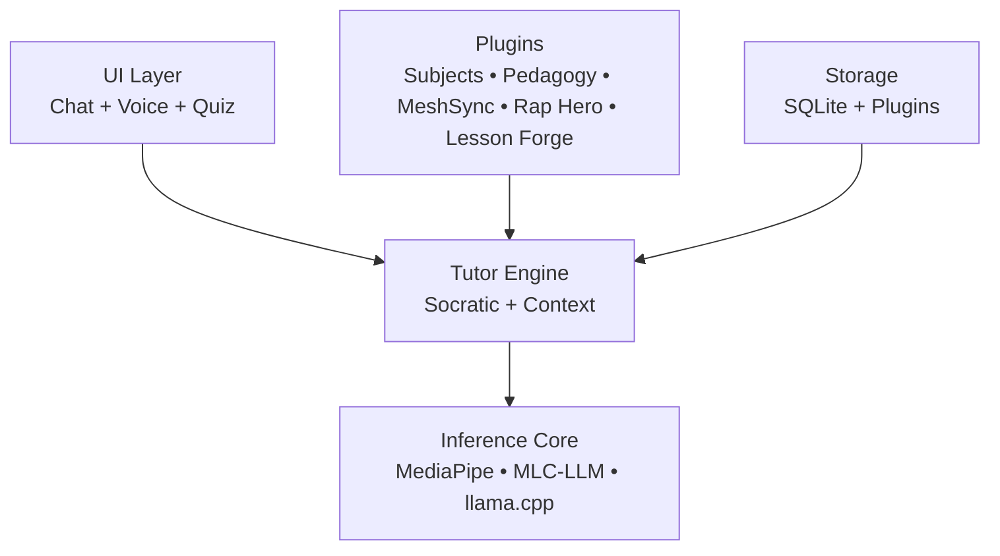

# OpenTutor Framework

**Transforming discarded smartphones into private, offline AI tutors for equitable education.**

OpenTutor is a lightweight, modular, offline-first framework that converts unused Android devices (2019–2023 models with 4–8 GB RAM) into personalized Socratic learning systems. It operates entirely on-device using small, optimized language models—requiring no internet access and preserving full user privacy.

---

## Table of Contents
- [Executive Summary](#executive-summary)
- [Problem Statement](#problem-statement)
- [Solution](#solution)
- [Key Differentiators](#key-differentiators)
- [Architecture](#architectuure)
- [Core Features](#core-features)
- [Intended Impact](#intended-impact)
- [Implementation Approach](#implementation-approach)
- [Current Implementation Status](#current-implementation-status)
- [Quick Start](#quick-start)
- [Project Status](#project-status)
- [Contact / Collaboration](#contact--collaboration)

---

## Executive Summary
Access to high-quality, personalized education remains uneven, particularly in low-resource and connectivity-limited environments. At the same time, millions of functional smartphones are discarded each year.

**OpenTutor addresses both challenges simultaneously:**
* **Repurposes e-waste** into educational infrastructure.
* **Provides private, offline AI tutoring** for those without web access.
* **Enables educators** to create and share content without centralized control.

---

## Problem Statement
* **Digital inequity**: Many learners lack consistent internet access for modern AI tools.
* **Privacy concerns**: Cloud-based tutoring systems require sensitive student data.
* **Rigid pedagogy**: Most edtech platforms prioritize answers over reasoning.
* **E-waste growth**: Millions of usable devices are discarded annually.

---

## Solution
OpenTutor transforms low-cost, secondhand Android devices into **offline-first Socratic tutors** that:
* Run entirely on-device (no cloud dependency).
* Guide students through reasoning instead of providing answers.
* Adapt to learner behavior over time.
* Support extensible, educator-created content via plugins.

---

## Key Differentiators
* **Offline-first architecture**: Fully functional without internet access.
* **Privacy by design**: No external data transmission.
* **Socratic tutoring model**: Emphasizes critical thinking and inquiry.
* **Device reuse model**: Converts e-waste into educational tools.

---

## Architecture

---

## Core Features
* **Plugin System**: Modular subject and pedagogy extensions (e.g., math, literacy).
* **MeshSync**: Bluetooth-based transfer of educational content (hints, sequences).
* **Rap Hero**: Creative expression through educational rap generation.
* **Lesson Forge**: Enables students to create and share their own lessons.
* **Adaptive Learning**: Tracks learner behavior to tailor responses dynamically.

---

## Intended Impact
* **Short-term**: Provide accessible tutoring tools in low-connectivity environments.
* **Medium-term**: Build a distributed ecosystem of shared educational content.
* **Long-term**: Establish a global, open infrastructure for personalized learning.

---

## Implementation Approach
* **Phase 1 (Current)**: Functional plugin system, on-device inference, and early MeshSync prototype.
* **Phase 2**: Stability across a wider range of devices and expanded educator tooling.
* **Phase 3**: Scaled content ecosystem and community-driven plugin marketplace.

---

## Current Implementation Status
```mermaid
| Plugin / Component                  | Path                                      | Status          | Completeness Notes |
|-------------------------------------|-------------------------------------------|-----------------|--------------------|
| Core Framework (Android + Gradle)   | `/`                                       | Functional      | Builds and installs APK |
| Plugin System                       | `plugins/`                                | Early Alpha     | Basic loading supported |
| Subjects Container                  | `plugins/subjects/`                       | Functional      | Directory structure ready |
| **Basic Math** | `plugins/subjects/basic-math/`            | **Partial** | `manifest.json` + core content files + `examples/` present. Missing: `config/`, `lessons/`, `exercises/`, `tests/`, full metadata |
| Pedagogy Plugins                    | `plugins/pedagogy/`                       | Partial         | Directory exists; content TBD |
| Sync / MeshSync                     | `plugins/sync/`                           | Prototype       | Early Bluetooth/offline sharing |
| Rap Hero                            | (Referenced in architecture)              | Planned         | Not yet implemented as plugin |
| Lesson Forge                        | (Referenced in architecture)              | Planned         | Not yet implemented |
| Inference Core (MediaPipe / llama.cpp) | Core module                     | Integrated      | On-device inference ready |

**Legend**:  
* **Functional** = Works end-to-end  
* **Partial** = Core files present, but incomplete structure/features  
* **Prototype** = Basic proof-of-concept  
* **Planned** = Mentioned in docs/architecture but not coded yet

---

## Quick Start

### Prerequisites
* Android Studio (or Gradle 8+).
* Compatible Android device (2019–2023 model, 4–8 GB RAM).
* USB debugging enabled.

### Build & Test Sequence
1. Clone the repo: `git clone https://github.com/NewmanB1/OpenTutorFramework.git`
2. Enter the directory: `cd OpenTutorFramework`
3. Build the APK: `./gradlew assembleDebug`
4. Install on device: `adb install -r app/build/outputs/apk/debug/app-debug.apk`

---

## Project Status
**Current Phase: Early Alpha**

* **Core Framework**: Functional (Builds and installs APK)
* **Plugin System**: Alpha (Basic loading supported)
* **Basic Math**: Partial (manifest.json and prompts present)
* **MeshSync**: Prototype (Early Bluetooth sharing)
* **Inference Core**: Integrated (MediaPipe / llama.cpp ready)

---

## Contact / Collaboration
We are actively seeking pilot partners (schools, libraries) and educators interested in plugin development.

**OpenTutor is built for communities, not platforms.**
