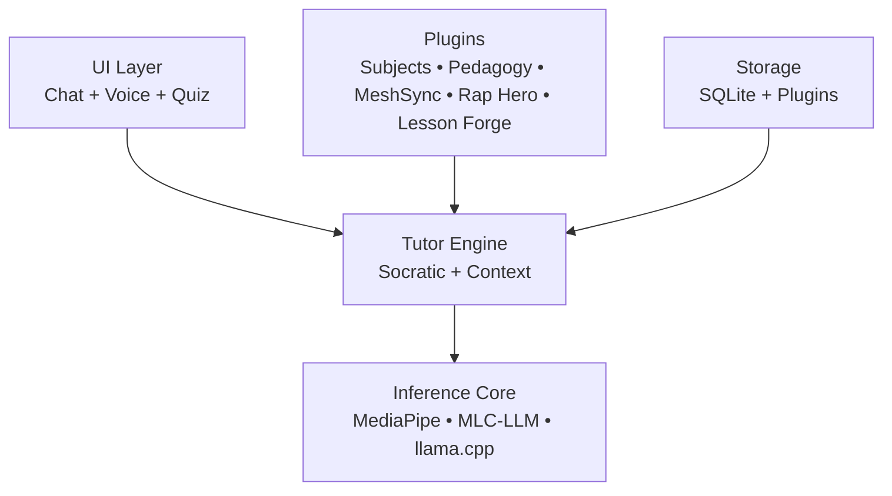

# OpenTutor Framework

[](LICENSE)

**Transforming discarded smartphones into private, offline AI tutors for equitable education.**

OpenTutor is a lightweight, modular, offline-first framework that converts unused Android devices (2019–2023 models with 4–8 GB RAM) into personalized Socratic learning systems. It operates entirely on-device using small, optimized language models—requiring no internet access and preserving full user privacy.

---
## Table of Contents

- [Why This Matters](#why-this-matters)
- [Executive Summary](#executive-summary)
- [Problem Statement](#problem-statement)
- [Solution](#solution)
- [Key Differentiators](#key-differentiators)
- [High-Level Architecture](#high-level-architecture)
- [Core Features](#core-features)
- [Intended Impact](#intended-impact)
- [Implementation Approach](#implementation-approach)
- [Quick Start](#quick-start)
- [Documentation](#documentation)
- [Evaluation and Future Work](#evaluation-and-future-work)
- [Contributing](#contributing)
- [License](#license)
- [Project Status](#project-status)
- [Contact / Collaboration](#contact--collaboration)

## Executive Summary

Access to high-quality, personalized education remains uneven, particularly in low-resource and connectivity-limited environments. At the same time, millions of functional smartphones are discarded each year.

**OpenTutor addresses both challenges simultaneously:**

* Repurposes e-waste into educational infrastructure
* Provides private, offline AI tutoring
* Enables educators to create and share content without centralized control

The project is designed as an open, community-driven ecosystem where teachers, students, and developers collaboratively build and refine educational tools.

---

## Problem Statement

* **Digital inequity**: Many learners lack consistent internet access for modern AI tools
* **Privacy concerns**: Cloud-based tutoring systems require sensitive student data
* **Rigid pedagogy**: Most edtech platforms prioritize answers over reasoning
* **E-waste growth**: Millions of usable devices are discarded annually

These issues intersect most strongly in underserved communities.

---

## Solution

OpenTutor transforms low-cost, secondhand Android devices into **offline-first Socratic tutors** that:

* Run entirely on-device (no cloud dependency)
* Guide students through reasoning instead of providing answers
* Adapt to learner behavior over time
* Support extensible, educator-created content via plugins

---

## Key Differentiators

* **Offline-first architecture** → fully functional without internet access
* **Privacy by design** → no external data transmission
* **Socratic tutoring model** → emphasizes critical thinking and inquiry
* **Device reuse model** → converts e-waste into educational tools
* **Open plugin ecosystem** → educators directly shape pedagogy

---

## High-Level Architecture



---

## Core Features

* **Plugin System**
  Modular subject and pedagogy extensions (e.g., math, literacy, science)

* **MeshSync (Offline Sharing)**
  Bluetooth-based transfer of small educational content:

  * Hints
  * Question sequences
  * Creative learning artifacts (e.g., rap lyrics)

* **Rap Hero**
  Supports creative expression through educational rap generation and performance

* **Lesson Forge**
  Enables students to create and share their own lessons with peer feedback

* **Adaptive Learning State**
  Tracks learner behavior to tailor responses dynamically

* **Media Constraints Model**
  Ensures large content (video, etc.) is handled through intentional, manual workflows

---

## Intended Impact

**Short-term:**

* Provide accessible tutoring tools in low-connectivity environments
* Enable educators to experiment with AI-assisted pedagogy

**Medium-term:**

* Build a distributed ecosystem of shared educational content
* Reduce dependency on centralized edtech platforms

**Long-term:**

* Establish a global, open infrastructure for personalized learning
* Reframe discarded consumer devices as community educational assets

---

## Implementation Approach

### Phase 1 (Current)

* Functional plugin system
* On-device inference integration
* Early MeshSync prototype

### Phase 2

* Stability across a wider range of devices
* Expanded educator tooling (Lesson Forge)
* Pilot deployments in classrooms or community programs

### Phase 3

* Scaled content ecosystem
* Community-driven plugin marketplace
* Measurable learning outcome studies

---

## Quick Start (Technical)

```bash id="xk1z8u"
./gradlew assembleDebug
```

1. Clone the repository
2. Connect a compatible Android device (2019–2023 recommended)
3. Build and install the APK
4. Test included plugins (e.g., basic math)

---

## Documentation

* `ARCHITECTURE.md` — System design and technical overview
* `PLUGINS.md` — Plugin development guide
* `docs/media-guidelines.md` — Content sharing constraints
* `CONTRIBUTING.md` — Contribution guidelines

---

## Evaluation and Future Work

Future development will include:

* Formal evaluation of learning outcomes
* Usability studies in classroom environments
* Optimization for lower-end hardware
* Expansion of subject-specific pedagogical plugins

---

## Contributing

We actively welcome contributions from:

* Educators
* Students
* Developers
* Community organizations

See `CONTRIBUTING.md` for details.

---

## License

Apache 2.0 — see `LICENSE` file for details.

---

## Project Status

**Early Alpha**

Core systems are functional, with ongoing testing of MeshSync and plugin expansion.

---

## Contact / Collaboration

We are actively seeking:

* Pilot partners (schools, libraries, community centers)
* Educators interested in plugin development
* Contributors in mobile, AI, and education

---

**OpenTutor is built for communities, not platforms.**
